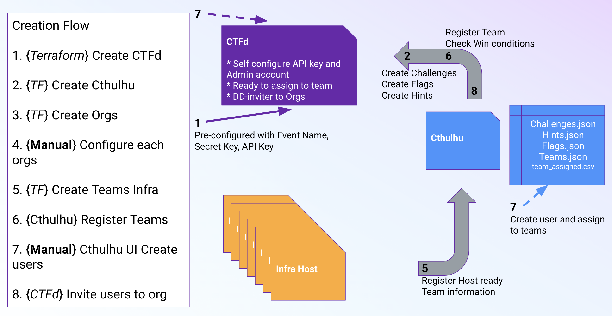

# Terraform for DPN Tears of SRE - ESE 
Welcome to the Datadog Partner Network Tears of SRE technical challenge!

If you are running the event, you can use this presentation teamplate for the event: [Presentation template](https://docs.google.com/presentation/d/1FNWH_JEhXRNPdYF11POoPmIs1f7wVb3ZGBt7UfNjMdE).

Also, please reference this checklist to ensure you don't forget anything before your event: [Checklist](https://datadoghq.atlassian.net/wiki/spaces/~712020763ace46fee348628d3ced185ecdd88c/pages/3920199823/Tears+of+SRE+Workshop+Checklist+Template)

## What is the challenge?
Our Datadog Swagstore is open to the public, and for Black Friday, amazing gear will be discounted, which will increase the website demand. All the SREs operating the Swagstore are missing, so we need you (the game participants) to step in to support the organization!

You will be put into random teams, each working toward a common goal, but each team gets its own [Swagstore stack](https://github.com/DataDog/tsre-microservices) and its own Datadog Org.

Your team's goal is to capture all the flags related to a micro-service-architected application called **Swagstore** using Datadog. The stack is supported by 12 microservices running on a Kubernetes cluster hosted on an EC2 instance. For some challenges, you may need to restart the stack (wink wink).

## How does it Work?
The Terraform scripts included in this repo will spin up everything needed for the event. There is an AWS EC2 instance for each component: CTFd, Cthulhu, and Swagstore Infrastructure.

### The components
There will be one AWS EC2 instance for **Swagstore Infrastructure** per **team** defined in the `tsre-terraform/<event-shortname>.tfvars`.

These are the components overview:

|[CTFd](https://github.com/DataDog/pts-CTFd)|[Cthulhu](https://github.com/DataDog/tsre-cthulhu)|[Swagstore Infrastructure](https://github.com/DataDog/tsre-microservices)|
|--------|-----------|-----------------------|
|Handles user registration|Manages teams|Provides a Kubernetes cluster|
|Assigns teams|Creates challenges, hints, and flags|Hosts Swagstore microservices|
|Manages scorekeeping|Checks final challenge completion|Includes a fraudulent service|
|Records flag submissions|Supports bulk user creation||
|Oversees challenge management|||

For more details reference the [Everything about Tears of SRE](https://docs.google.com/presentation/d/1zoecX0HqGsSVuyw2Rc_OOXZGPYgBV5VDtWt4dsxRYzE/edit#slide=id.g1e07bf1996f_3_1588) slides and review the README of each components.

### Interactions between components


## Repo Structure
1. Core Infrastructure (`core_infrastructure.tf`)
    - Start CTFd - Custom instance of CTFd used for TSRE
    - Start Cthulhu - Master control server for TSRE
    - Registers Ctfd to `<event_shortname>.<domain>`
    - Registers Cthulhu to `cthulhu-<event_shortname>.<domain>`
    - Generate Scripts for org provisioning
    - Generate tfvars file for Instance creation

2. Create Team Orgs (`create_orgs.tf`)
    - Create sub-orgs in Datadog under the Org associated to the <dd_api_key> and invite the event administrators <dd_admins>

3. Provisions the Team Orgs (`instancesetup/01-provision_org`)
    - 10 - Create custom role without the rights for SecSignal 
    - 20 - Create SLOs
    - 60 - Set up DBM Monitors
    - `dpnctf` Create Challenge Specific configurations

4. Create Swagstore Infrastructure for each teams (`instancesetup/02-create-instance`)

## How to Run This?

### Prepration Steps
1. Create your own branch from this repository.

2. Copy and rename the `terraform.tfvars.sample` (E.g. dash2024.tfvars) 
    > **Note:** Make sure to remove `.sample` from the end of your **tfvars** file.

3. Update the .tfvars file with proper variables 
    > **Note:** See this Confluence Page for additional hints/details: [Tfvars File](https://datadoghq.atlassian.net/wiki/spaces/~712020763ace46fee348628d3ced185ecdd88c/pages/3779493938/Tfvars+File)

    | **Variable Name**     | **Description**| **Additional Details**|
    |-----------------------|--------------------------------------------------------------------------------------------------------|--------------------------------------------------------------------------------------------------|
    | domain  | The domain name for your instance. Must be a subdomain of dashpartnersummit.com or ddctf.com | Default to ddctf.com |
    | dd_api_key | Datadog Parent Org API key (E.g. `DPN Admin org 422764`)      | Go to Datadog [Org API key](https://app.datadoghq.com/organization-settings/api-keys) management page|
    | dd_app_key | Datadog Parent Org Application key (E.g. `DPN Admin org 422764`) | Go to Datadog [Org Application key](https://app.datadoghq.com/organization-settings/application-keys) management page |
    | dd_admins  | A list of admin emails for the Datadog Team orgs. | Example setting: ["admin1@datadoghq.com", "admin2@datadoghq.com"]|
    | teams   | A list of team names for each instance you want to create. | Example setting: ["Team-1", "Team-2", "Team-3"]|
    | event_shortname| The name of your Capture the Flag event in a form without whitespaces. | Used in URLs: CTFD: `<event_shortname>.<domain>` & CTHULU: `cthulu-<event_shortname>.<domain>` |
    | event_name | The name of your Tears of SRE event | |
    | event_description     | The description of your Tears of SRE event | |
    | aws_key | AWS Access Key for programmatic access     | See [Tfvars File Confluence](https://datadoghq.atlassian.net/wiki/spaces/~712020763ace46fee348628d3ced185ecdd88c/pages/3779493938/Tfvars+File) for more details |
    | aws_secret_key | AWS Secret Key for programmatic access     | See [Tfvars File Confluence](https://datadoghq.atlassian.net/wiki/spaces/~712020763ace46fee348628d3ced185ecdd88c/pages/3779493938/Tfvars+File) for more details|
    | ssh_key | SSH key used to access CTFD, CTHULHU, TSRE-Microservices private repositories | See [Tfvars File Confluence](https://datadoghq.atlassian.net/wiki/spaces/~712020763ace46fee348628d3ced185ecdd88c/pages/3779493938/Tfvars+File) for more details|
    | ssh_passkey| passkey entered to export the ssh_key | See [Tfvars File Confluence](https://datadoghq.atlassian.net/wiki/spaces/~712020763ace46fee348628d3ced185ecdd88c/pages/3779493938/Tfvars+File) for more details|
    | ctfd_token | CTFD API token  | Example token: `ctfd_3baad6b9cd6e916e6178d91467a1e5ab7e01718da628854b51beef78d2c3e8e3` |
    | cthulhu_version| Branch name for CTHULHU repository| Default branch: `main`. [CTHULHU Repository link](https://github.com/DataDog/tsre-cthulhu) |
    | ctfd_version | Branch name for CTFD repository | Default branch: `master`. [CTFD Repository link](https://github.com/DataDog/pts-CTFd)   |
    | microservices_version | Branch name for TSRE-Microservices repository | Default branch: `main`. [TSRE-Microsrvices Repository link](https://github.com/DataDog/tsre-microservices) |


### Spin up the Tears of SRE environment 
1. Make sure you are in the root directory of the repository and your `.tfvars` file is present.
2. Verify that the Terraform scripts will run successfully.
    > **Note:** Don’t forget to run `terraform init` before running Terraform commands if you're running this for the first time.
    ```bash
    terraform plan --var-file="<myFileName>.tfvars"   
    ```
3. Run the Terraform scripts.
    ```bash
    terraform apply --var-file="<myFileName>.tfvars"   
    ```
4. Navigate to the `instancesetup/01-provision_org` directory.
5. Run the bash script starting with `<event-shortname>_apply.sh`.
6. Verify CTFD and Cthulhu are running
    1. On your browser, go to `<event-shortname>.<domain>`
    2. Verify the CTFD page loads  
        
    3. Login with **admin** | **DARKEN7monday_copperas.revenge**
    4. Go to the Challenges Page: `<event-shortname>.<domain>/admin/challenges`
    5. Verify that you see challenges displayed  
        
    6. On your browser, go to `cthulhu-<event-shortname>.<domain>`
    7. Verify that the Cthulhu homepage loads  
        
7. For each team Datadog Orgs, perform the steps below:
    > **Note:** All Steps needs to be manually executed before the creation of all instances

    1. Login with password
    2. Logs
        1. Click **Getting Started**
    3. Security
        1. Enable CSM Enterprise
            1. Click **Selecty** under **Quick Start**
            2. Click **Start Using Cloud Security Management**
            3. Click **Exit to Standard Setup**
        2. Create recommended Security Notification rule
            1. Go to **Security** -> **Settings** -> **General** -> **Notifications**
                1. Click **Start with Recommended Rules**
    4. Organization Settings
        1. Security -> **Remote configuration**
            1. Confirm **Remote Configuration** is enabled
        2. Access -> **API Keys**
            1. Confirm **RC** is set for API Key
        3. Compliance -> **Audit Trails**
            1. Click **Enable Audit Trail**
        4. Compliance -> **Sensitive Data Scanner**
            1. Click *Get Started*
            2. Enable the toggle for **Sample Group: Scan production environment telemetry**
                
            3. Update `env:prod` to `env:tsreenv OR env:trseenv`
            4. Edit **Standard Email Address Scanner** 
                1. Update **Define Action on Match** to `redact`
                    1. Set `[sensitive data]` as the **Replacement Text**
    5. As `<DATADOG USER>`
      1. Disable default Notification rule
          1. Go to Security -> **Settings** 
          2. Toggle **Off** for “Critical and High Severity Signals”
          3. Go to **Organization Settings** -> **Compliance** -> **Audit Trails**
          4. In the facet filter by:
              1. **Event Name**: Cloud Security Platform
              2. **Action**: Modified
              3. **Asset Profile**: notification_profile
          5. The **User Name** and **User ID** are the answers for **Challenge 16**
              
    2. Update the solution for **“Security signals are missing!** Challenge 16
        1. Go to Admin -> **Challenges** -> Select **Security signals are missing!**
        2. Update **Flags** (The Solution) to what you got from the previous step (email and name)
            
    6. Set up **START TIME** in your CTFd instance  
        1. Under `<event-shortname>.<domain>/admin/config` -> **Time**
            
8. Go to the `instancesetup/02-create-instance` directory
9. Verify that the Terraform scripts will run successfully.
    > **Note:** Don’t forget to run `terraform init` before running Terraform commands if you're running this for the first time.
    ```bash
    terraform plan --var-file="<myFileName>.tfvars"   
    ```
10. Run the Terraform scripts.
    > **Note:** It will take a while to spin up all instances – be patient...
    ```bash
    terraform apply --var-file="<myFileName>.tfvars"   
    ```
11. Verify Setup
    1. On your browser, go to the AWS Portal (e.g., Datadog Partner Network).
    2. Go to the **EC2 Portal** -> **Instances Running**  
        
    3. Confirm you see one instance per team defined in the `<event-shortname>.tfvars` file.  
          
        
    4. Validate you can see logs flowing in your parent org (e.g., “DPN | Admin”).  
        
    5. Verify SWAGSTORE is up for each team (`<team-name>.<domain>`).  
        
        > **Note:** If you see a **502 Bad Gateway Error**, it means Nginx had trouble starting. Go to the EC2 instance and follow the [Gateway Error](https://docs.google.com/presentation/d/1zoecX0HqGsSVuyw2Rc_OOXZGPYgBV5VDtWt4dsxRYzE/edit#slide=id.g2e553921fec_0_0) steps.  
        
12. Enable Event Self-Registration
    1. On your browser, go to <event-shortname>.<domain>
    2. Login with:
      - **Username**: `admin`
      - **Password**: `DARKEN7monday_copperas.revenge`
    3. Go to Config -> **Settings**
        1. Set **Registration Visibility** to **Public**
13. Update the Homepage **Click here** button to redirect to the registration page instead of the login page:
    1. On the CTFD admin page:
    2. Go to **Pages** -> **All Pages**
    3. Click **Index**
    4. Update the **href** to point to the registration page instead of the login page.
        
    5. Open `<event-shortname>.<domain>` in incognito mode
    6. Make sure you see the **Register** option
    7. Verify that clicking **Click here** redirects to `<event-shortname>.<domain>/register`
        

## Stop the Tears of SRE Environment
1. Go to the `instancesetup/02-create-instance` directory.
2. Destroy the Team instances:
    ```bash
    terraform destroy --var-file=<myFileName>.tfvars
    ```
3. Wait until the process completes.
4. Go to the `instancesetup/01-provision_org` directory.
5. Run the bash script to destroy the org configuration: `<event-shortname>_destroy.sh`.
6. Run the bash script to rename the orgs: `<event-shortname>_rename.sh`.
7. Go back to the root Terraform directory.
8. Destroy the CTFD and Cthulhu instances:
    ```bash
    terraform destroy --var-file=<myFileName>.tfvars
    ```
9. **Manual Step** - Deactivate all orgs manually:
    1. Go to [SupportDog](https://supportdog.us1.prod.dog/?org=2).
    2. Search for the org name.
    3. Click the **Disable** button at the bottom of the org detail page:  
        
    4. Follow the prompts to disable.

## Troubleshooting
See this [slides](https://docs.google.com/presentation/d/1zoecX0HqGsSVuyw2Rc_OOXZGPYgBV5VDtWt4dsxRYzE/edit#slide=id.g2ca1b1f3ae3_0_1699) for the troubleshooting guide.

## Useful command

### Team Instance Debug Commands

Get all pods running
  ```bash
  kubectl get pods
  ```

Get all services running
  ```bash
  kubectl get svc
  ```

Check the status of *datadog-agent* (Technically you can run any agent command from there including *agent configcheck* for example)
  ```bash
  kubectl exec $AGENT_POD -- agent status
  ```

If the control plane goes down you can restart it with
  ```bash
  minikube start
  ```

### Terraform with workspace
```sh
terraform workspace new myname
terraform workspace select myname
terraform apply -var-file=terraform.tfvars
```

## TODO
* Add download file in Cthulhu
* Generate SSH key on the fly
* Generate CTFD_Token
* Find way to automate org deletion automatically
